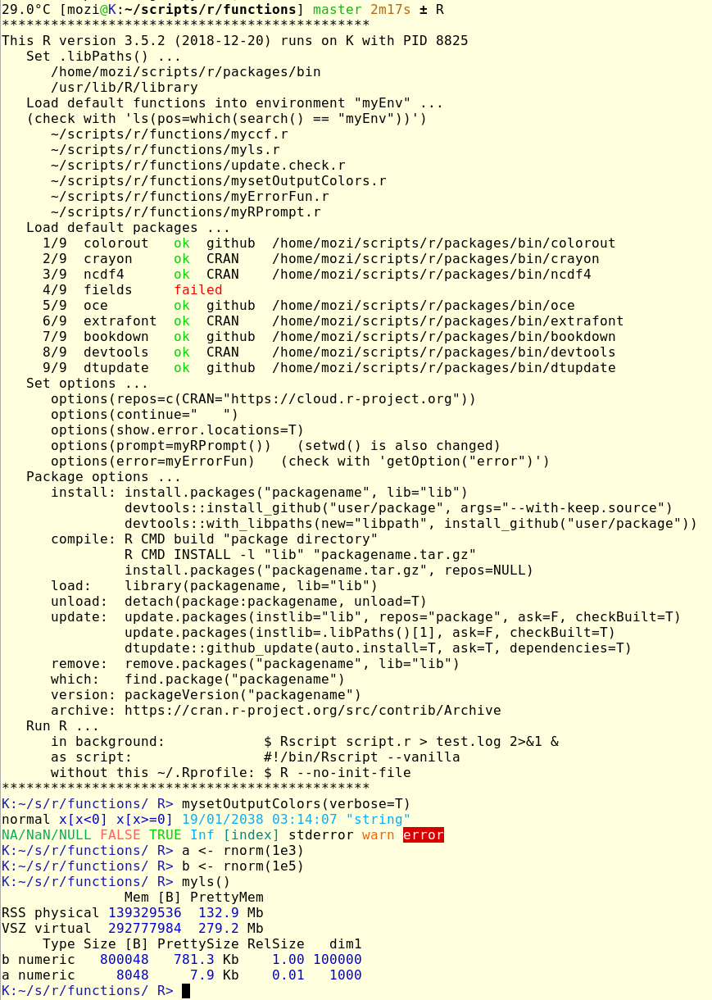

# dotfiles

If you want, after cloning the repo, save your dotfile and link the new one with
```bash
mv ~/.bash_profile ~/.bash_profile.save
mv ~/.bashrc ~/.bashrc.save
mv ~/.vimrc ~/.vimrc.save
mv ~/.Rprofile ~/.Rprofile.save
ln -s ~/dotfiles/bash_profile ~/.bash_profile
ln -s ~/dotfiles/bashrc ~/.bashrc
ln -s ~/dotfiles/liquidpromptrc ~/.liquidpromptrc
ln -s ~/dotfiles/vimrc ~/.vimrc
ln -s ~/dotfiles/Rprofile ~/.Rprofile
```
After every further `git pull`, the dotfile link gets updated automatically.

The `Rprofile` results in (check the `functions` repo for function defs):
<br><br>


