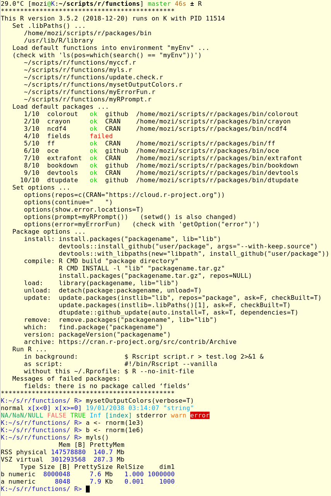

# dotfiles

```
# optional
git clone https://github.com/nojhan/liquidprompt.git
ln -s ~/sw/liquidprompt/liquidprompt ~/bin/liquidprompt

# this repo
git clone https://github.com/chrisdane/dotfiles.git
```

If you want, after cloning, save your dotfiles and link the new ones with
```bash
mv ~/.bash_profile ~/.bash_profile.save
mv ~/.bashrc ~/.bashrc.save
mv ~/.gitconfig ~/.gitconfig.save
mv ~/.Rprofile ~/.Rprofile.save
mv ~/.vimrc ~/.vimrc.save
ln -s ~/sw/dotfiles/bash_profile ~/.bash_profile
ln -s ~/sw/dotfiles/bashrc ~/.bashrc
ln -s ~/sw/dotfiles/gitconfig ~/.gitconfig
ln -s ~/sw/dotfiles/liquidpromptrc ~/.liquidpromptrc
ln -s ~/sw/dotfiles/Rprofile ~/.Rprofile
ln -s ~/sw/dotfiles/vimrc ~/.vimrc
```
After every further `git pull`, the dotfile link gets updated automatically.

The `Rprofile` results in (check the `functions` repo https://chrisdane@github.com/chrisdane/functions.git):
<br><br>


# todo

- `~/.pythonrc.py`

